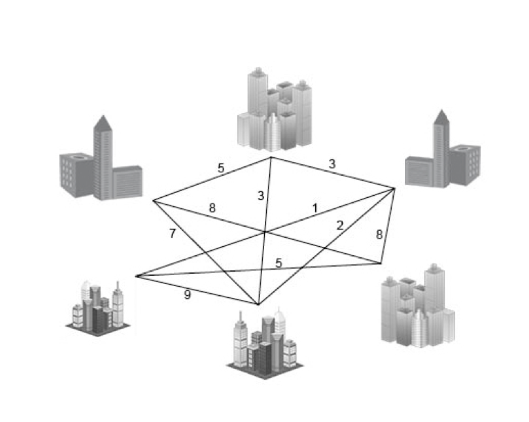

Assignment 6, Task B
====================

1) Description of Jarnik, Prim and Dijkstra algorithm
-----------------------------------------------------

_TBD (max 100 words)_

2) Practical example
--------------------

3) Time complexity
------------------

_TBD_

